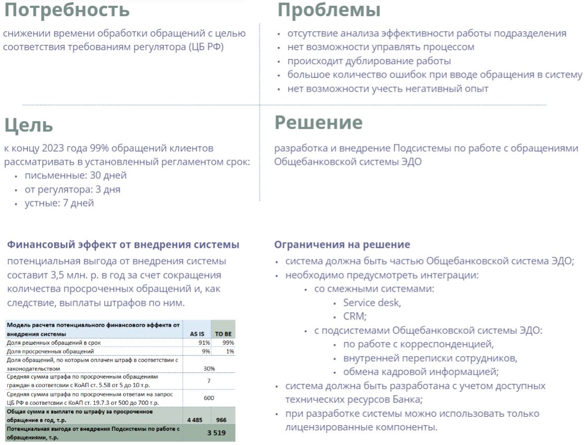
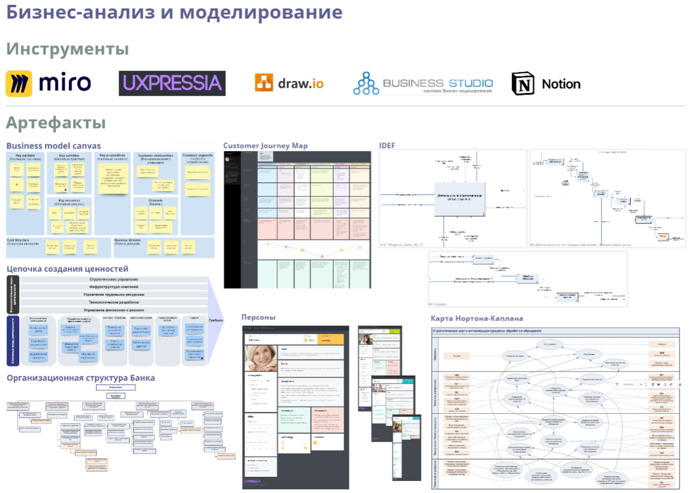
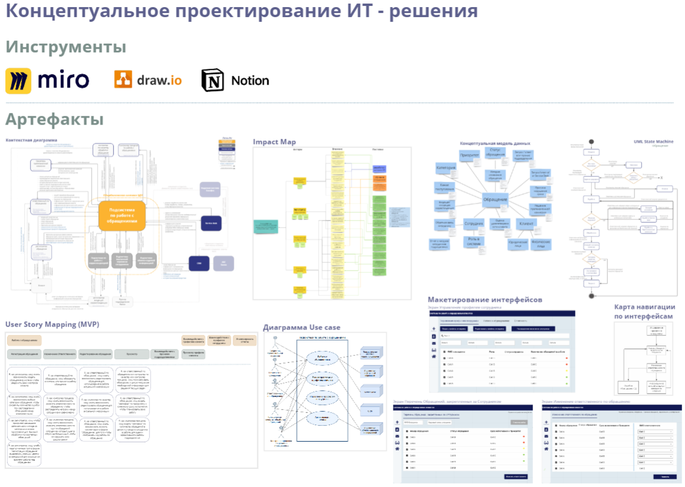
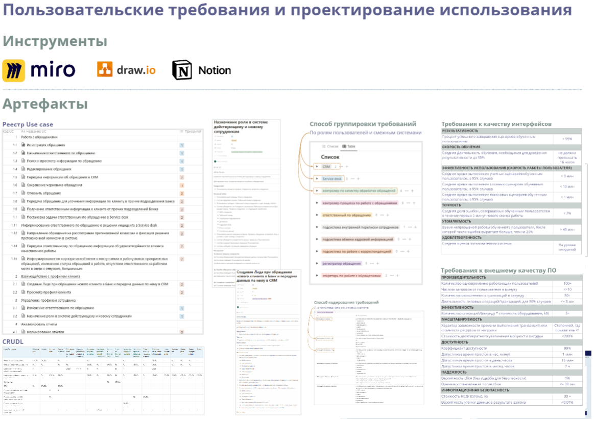
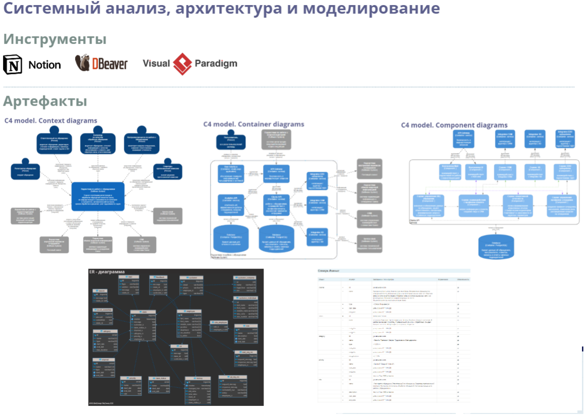

# Проект "Оптимизации процесса работы с обращениями клиентов в Банке", Декабрь 2022 г.

## Содержание
- [Легенда](#легенда)
- [Бизнес-анализ и моделирование](#бизнес-анализ-и-моделирование)
- [Концептуальное проектирование ИТ-решения](#концептуальное-проектирование-ит-решения)
- [Разработка пользовательских и системных требований](#разработка-пользовательских-и-системных-требований)
- [Системный анализ, архитектура и моделирование](#системный-анализ-архитектура-и-моделирование)
#

## Легенда
- В небольшом региональном банке была внедрена общебанковская системы ЭДО.
- Обратилось одно из структурных подразделений с потребностью в снижении времени обработки обращений с целью соответствия требованиям регулятора. 
- На основе полученной информации от заказчика и проведенного бизнес-анализа были установлены:

   
*подробно с данным артефактом можно ознакомиться [здесь](pages/IT_solution_concept.md)*
    
#
## [Бизнес-анализ и моделирование](pages/BA.md) 

-  Бизнес-модель компании - Business Model Canvas 
-  Цепочка создания ценности - Value Chain
-  Стратегическая карта Нортона-Каплана
-  Модель оргструктуры
-  Функциональное моделирование - нотация IDEF
-  Моделирование клиентского опыта - Customer Journey Map, persons

    

    *подробно с данными артефактами можно ознакомиться [здесь](pages/BA.md)*

#
## [Концептуальное проектирование ИТ-решения](pages/CD.md)
- Карта влияний - Impact Map
- Концепция ИТ-решения
- Контекстная диаграмма
- Концептуальная модель предметной области - UML Class
- Диаграмма состояний - UML State Machine
- Диаграмма сценариев использования - Use Case Diagam
- План поставок по созданию ИТ-решения - User Story Map (MVP)
- Черновые макеты экранов интерфейса системы
- Модель навигации по интерфейсу

    

    *подробно с данными артефактами можно ознакомиться [здесь](pages/CD.md)*
#
## [Разработка пользовательских и системных требований](pages/R.md)
- Сценарии использования - Реестр use cases
- Канонические функциональные требования
- Требования к внешнему качеству ИТ-решения и качеству в использовании
- Ограничения

      
    
    *подробно с данными артефактами можно ознакомиться [здесь](pages/R.md)*
#
## [Системный анализ, архитектура и моделирование](pages/SA.md)
- Проект архитектуры - C4 model
- Модель данных  
- Описание структуры данных

    

    *подробно с данными артефактами можно ознакомиться [здесь](pages/SA.md)*
    
    #
