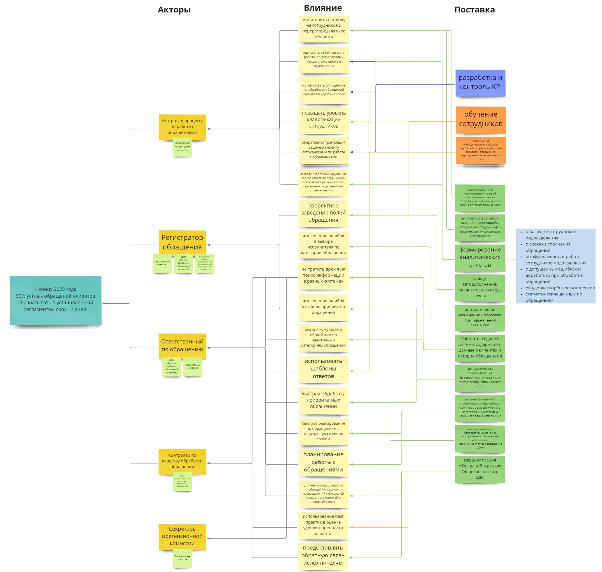
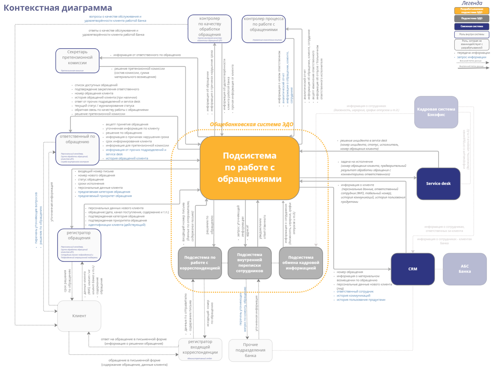
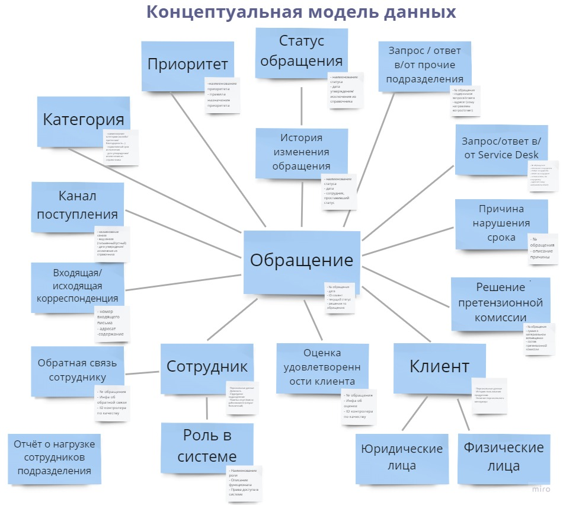
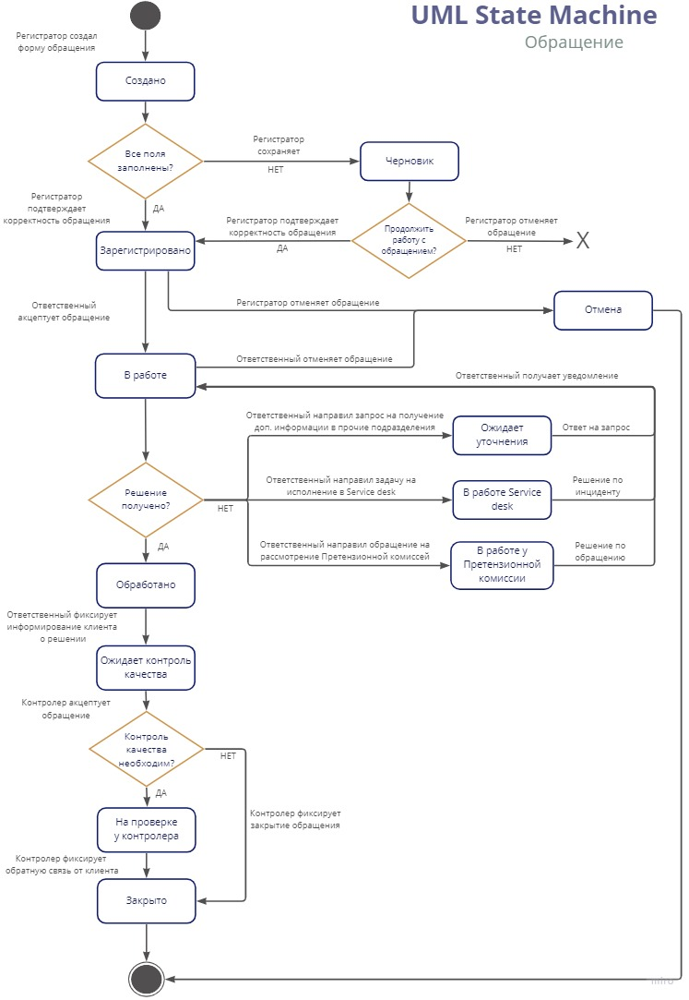
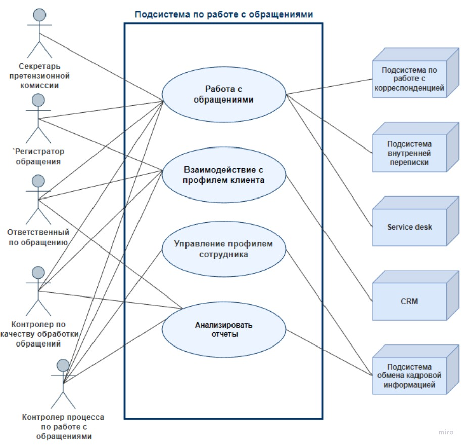
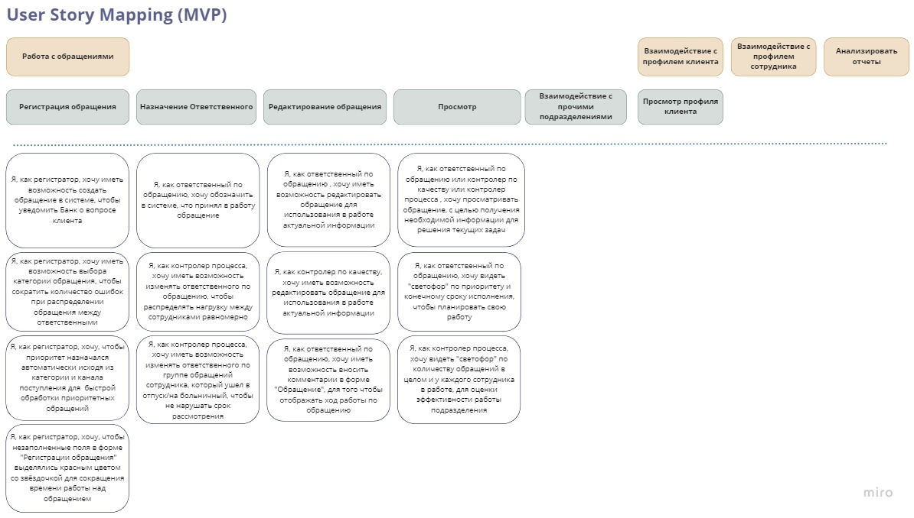
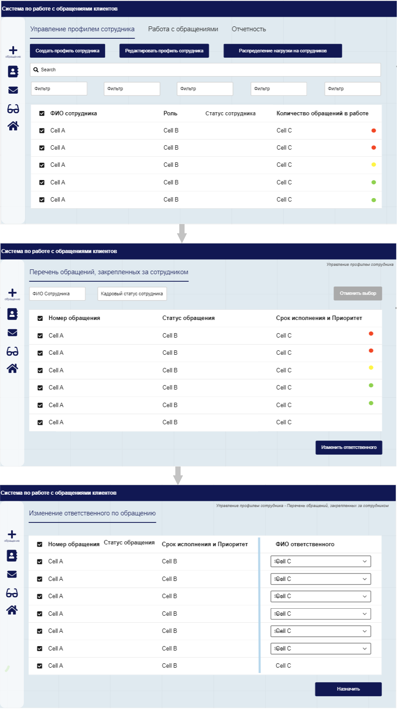
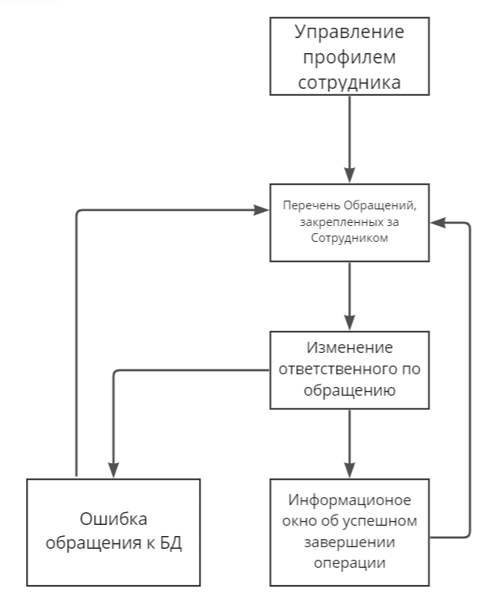

# Концептуальное проектирование ИТ-решения

## **Содержание**
 
- [Карта влияний - Impact Map](#карта-влияний---impact-map)  
- [Концепция ИТ-решения](../pages/IT_solution_concept.md) 
- [Контекстная диаграмма](#контекстная-диаграмма)  
- [Концептуальная модель предметной области - UML Class](#концептуальная-модель-предметной-области---uml-class)
- [Диаграмма состояний - UML State Machine](#диаграмма-состояний---uml-state-machine)
- [Диаграмма сценариев использования - Use Case Diagam](#диаграмма-сценариев-использования---use-case-diagam)  
- [План поставок по созданию ИТ-решения - User Story Map (MVP)](#план-поставок-по-созданию-ит-решения---user-story-map-mvp)  
- [Черновые макеты экранов интерфейса системы](#черновые-макеты-экрана-интерфейсов-системы)  
- [Модель навигации по интерфейсу](#модель-навигации-по-интерфейсу) 
#

## **Карта влияний - Impact Map**

#
## **Контекстная диаграмма**

#
## **Концептуальная модель предметной области - UML Class**
 

#
## **Диаграмма состояний - UML State Machine**

#
## **Диаграмма сценариев использования - Use Case Diagam**
 

#
## **План поставок по созданию ИТ-решения - User Story Map (MVP)**

#
## **Черновые макеты экрана интерфейсов системы**

### **UC - 3.2 Изменение ответственного по обращению**

#
## **Модель навигации по интерфейсу**
### **UC - 3.2 Изменение ответственного по обращению**

#
