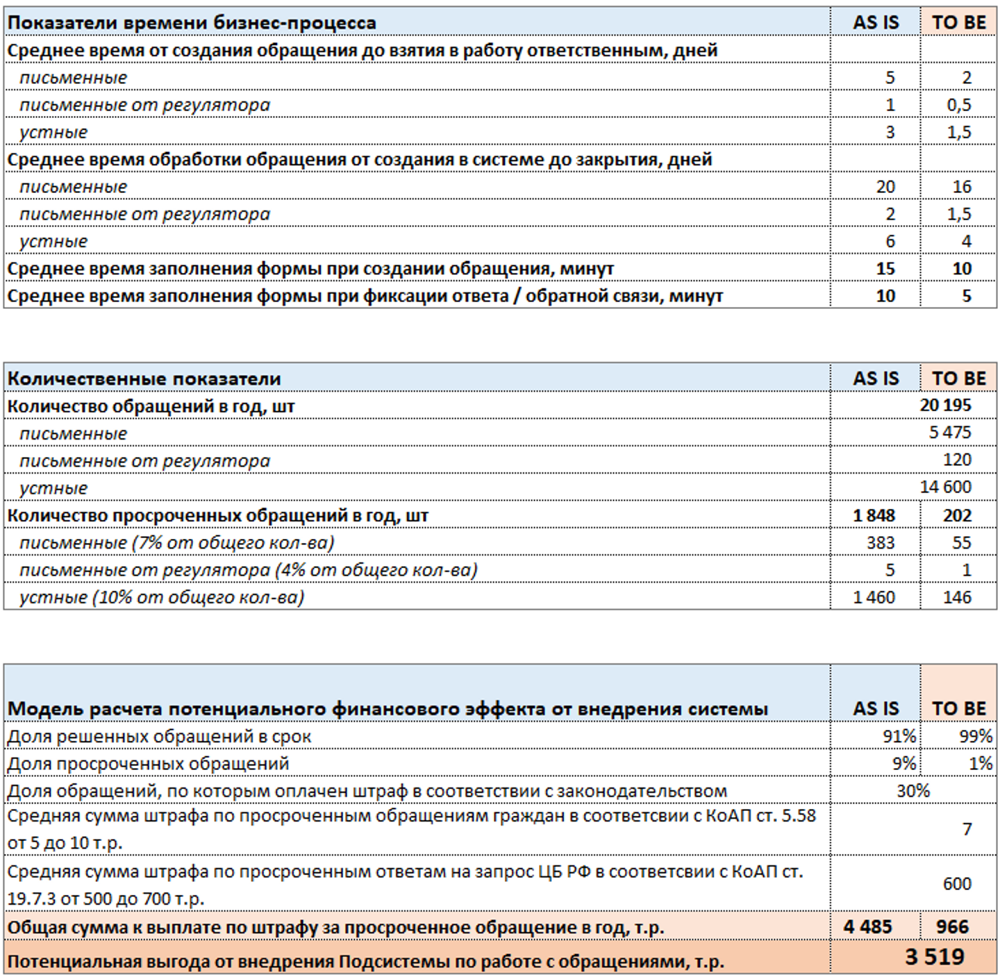

# Концепция ИТ-решения

## **Содержание**
- [Общие сведения](#общие-сведения)  
- [Настоящая ситуация](#настоящая-ситуация)  
- [Целевая ситуация](#целевая-ситуация)  
- [Концепция решения](#концепция-решения)
- [Дополнительная информация](#дополнительная-информация)  
#

## **Общие сведения**
### **Тема проекта** 
-  Оптимизация процесса работы с обращениями клиентов в Банке

### **Категория системы** 
- Подсистема по работе с обращениями Общебанковской системы ЭДО - Consumer Web App 

### **Заказчик** 
- Руководитель Управления клиентским опытом Банка
#
## **Настоящая ситуация**

### **Деятельность, которую хочется улучшить** 
- Работа с обращениями клиентов Банка

### **Заинтересованные стороны**
- Руководитель управления клиентским опытом (заказчик).
- Потенциальные пользователи системы - руководители и сотрудники:
    - Административного отдела
    - ЦТО
    - Бизнес подразделений
    - Управления клиентским опытом
    - Подразделений операционной поддержки
    - Члены претензионной комиссии
- Управление информационных технологий: руководитель, сотрудники, которые участвуют в разработке и внедрении системы.
- Клиенты Банка:  физические и юридические лица

### **Текущее решение** 

Процесс по работе с обращениями различается по каналам поступления:

- Письменные обращения:
    - заявку регистрируют в Административном отделе в 2-х системах (Общебанковская ЭДО, действующая система по работе с обращениям)
    - заявка падает на Группу обработки обращений клиентов ЦТО, по заявкам от регулятора - Службу внутреннего контроля
    - заявку берет в работу сотрудник Группы обработки обращений клиентов ЦТО / Службу внутреннего контроля
    - по заявке подготавливается ответ
    - ответ подписывает руководитель
    - ответ передается в Административный отдел на отправку
    

- Устные обращения:
   - заявку регистрирует сотрудник банка, работающий с клиентами / ЦТО
   - если у клиента есть персональный менеджер, то заявка поступает к нему в работу, иначе сотруднику Группы обработки обращений клиентов ЦТО
   - заявка берется в работу
   - по заявке подготавливается ответ / исполняется
   - клиента информирует ответственный за заявку (по каналу поступления)
   - заявка переходит сотрудникам Группы контроля качества клиентских обращений ЦТО, которые проверяют, доволен ли клиент сервисом
 

Вне зависимости от типа заявка может требовать каких-то действий других подразделений Банка, Service Desk, также если заявка требует материальной компенсации или в сложных случаях, собирается Претензионная комиссия и решение подготавливается ей.

Если нужна информация по клиенту, то сотрудники обращаются к системе CRM.
Если нужна информация по сотрудникам, то обращаются к кадровой системе Бэкофис.
Если необходимо решение технического вопроса, то инцидент заводят в  Service Desk.

- Письменные обращения:
    - направленные по почте
    - поданные клиентами через канцелярию Банка
    

- Устное обращение:
    - звонок в контакт-центр (горячая линия)
    - визит в отделение Банка
    - направление обращения по электронной почте
    - заполнение формы на сайте Банка / он-лайн чат
    - обратная связь клиента на сайте отзывов
    - обратная связь клиента в социальных сетях / мессенджерах

### **Существующие проблемы** 

- обращение регистрируется в разных системах, происходит дублирование работы
- отсутствует понимание на каком этапе находится обращение, кто ответственный за его исполнение - нет возможности управлять процессом
- отсутствует возможность анализа эффективности работы сотрудников, их загруженности
- нет анализа ретроспективы работы с обращениями - нет возможности учесть негативный опыт
- процесс регистрации и обработки обращения происходит преимущественно в "ручном режиме", что влечет за собой большое количество ошибок при вводе обращения в систему
- нарушение срока ответа по обращениям от ЦБ (регулятор) влечет наложение штрафов и прочих санкций
#   
## **Целевая ситуация**

### **Цель для Заказчика** 

К концу 2023 года 99% обращений клиентов обрабатывать в установленный регламентом срок:
- письменные: 30 дней
- от регулятора: 3 дня
- устные: 7 дней

Потенциальная выгода от внедрения “Подсистемы по работе с обращениями” составляет 3,5 млн. р. в год ввиду сокращения выплат по штрафам за нарушение законодательства в части работы с обращениями граждан и взаимодействия с регулятором.

### **Назначение** 

- Контролёр процесса по работе с обращениями:
    - мониторить нагрузку на сотрудников и перераспределять ее между ними
    - оценивать эффективность работы подразделения и каждого сотрудника в отдельности
    - выявлять причины нарушения сроков ответа по обращениям для выработка решения по их пресечению в дальнейшем
    - среднее время обработки обращения в системе от создания до закрытия:
        - письменные - 16 дней
        - письменные от регулятора -1,5 дня
        - устные - 4 дня
    - среднее время от создания обращения до взятия в работу ответственным:
        - письменные - 2 дня
        - письменные от регулятора -0,5 дня
        - устные - 1,5 дня
    - снизить долю просроченных ответов по обращению с 9% до 1%
    

    
- Регистратор обращения:
    - корректно заводить поля обращения
    - исключить ошибки в выборе исполнителя по категории обращения
    - не тратить время на поиск информации в разных системах
    - исключить ошибки в выборе приоритета обращения
    - тратить не более 10 минут на заполнение формы при создании обращения
    

- Ответственный по обращению:
    - не тратить время на поиск информации в разных системах
    - оперативно обрабатывать приоритетные обращения
    - оперативно реагировать по обращениям с подходящим к концу сроком
    - планировать работу с обращениями
    - уточнять информацию по обращению у других подразделений с фиксацией сроков, исполнителей и историей ответа
    - тратить не более 5 минут на заполнение формы при фиксации ответа
  
- Контролер по качеству обработки обращения:
    - не тратить время на поиск информации в разных системах
    - предоставлять обратную связь исполнителям
    - тратить не более 5 минут на заполнение формы при фиксации обратной связи
    

- Секретарь претензионной комиссии:
    - не тратить время на поиск информации в разных системах
    - фиксировать и хранить решение претензионной комиссии в одной системе
    - тратить не более 5 минут на заполнение формы при фиксации ответа

### **Ограничения на решение** 
- разрабатываемая система должна быть частью Общебанковской система ЭДО
- законодательство в части банковской деятельности
- необходимо предусмотреть интеграции с другими системами:
    - подсистема по работе с корреспонденцией
    - подсистема внутренней переписки сотрудников
    - подсистема обмена кадровой информацией
    - Service desk
    - CRM
#
## **Концепция решения**
### **Роли пользователей** 
- регистратор обращения
- ответственный по обращению
- контролер по качеству обработки обращения
- контролер процесса по работе с обращениями
- секретарь претензионной комиссии

### **Ключевые свойства и возможности** 

- Контролёр процесса по работе с обращениями:
    - информирование пользователя по корпоративной почте об отсутствии ответственного на рабочем месте в связи с отпуском, больничным
    - витрина с оперативной сводной информацией о нагрузке на сотрудников и графическим индикатором ("светофор")
    - автоматическое формирование управленческих отчётов: 
         - о нагрузке сотрудников подразделения
         - о сроках исполнения обращений
        - об эффективности работы сотрудников подразделения
        - о допущенных ошибках и доработках при обработке обращений
        - об удовлетворённости клиентов
        - другие статистические данные по обращениям

- Регистратор обращения / Ответственный по обращению / Контролер по качеству обработки обращения / Секретарь претензионной комиссии:
    - функция автодополнения / предиктивного ввода текста
    - автоматическое назначения категории
    - работа в единой системе, содержащей данные о клиентах и историю обращений
    - автоматическая приоритизация (в зависимости от канала поступления, типа клиента и т.п.)
    - витрина обращений с графическим индикатором ("светофор") в зависимости от категории обращения и с указанием конечного срока исполнения
    - информирование пользователя по корпоративной почте о:
        - поступлении в работу новых обращений
        - изменению статуса обращений, которые находятся в работе
    - полуавтоматическая маршрутизация обращений в рамках Общебанковского ЭДО
    - автоматическое формирование управленческих отчётов: 
         - о сроках исполнения обращений
        - об удовлетворённости клиентов
        - другие статистические данные по обращениям

### **Смежные системы (интеграции)** 
- подсистема по работе с корреспонденцией (Общебанковская система ЭДО);
- подсистема внутренней переписки сотрудников (Общебанковская система ЭДО);
- подсистема обмена кадровой информацией (Общебанковская система ЭДО);
- Service desk;
- CRM.
#
## **Дополнительная информация**

#
