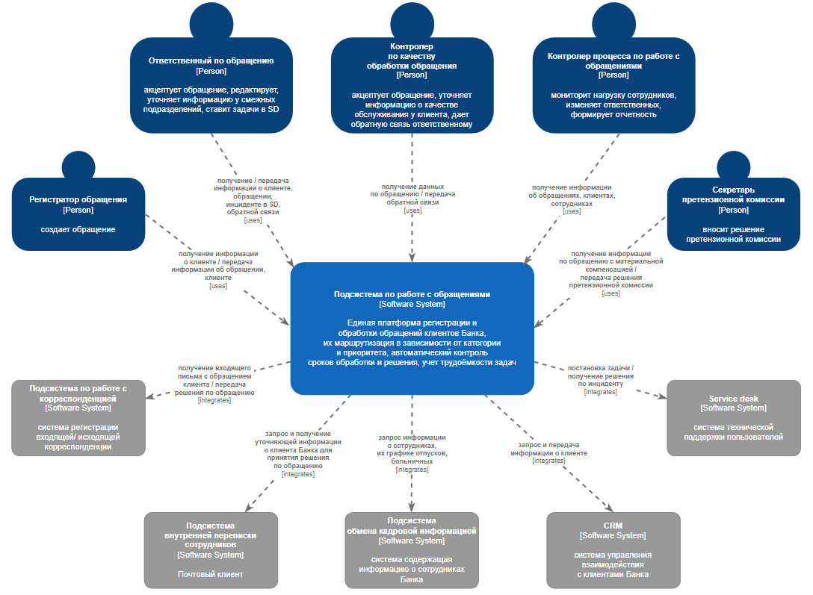
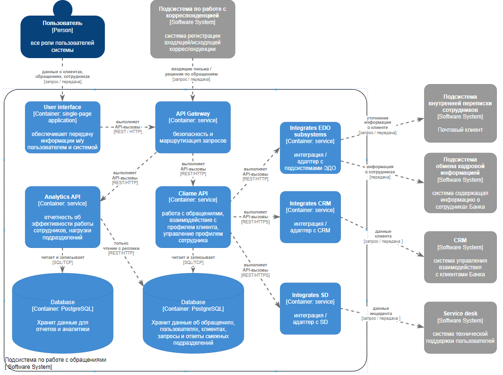
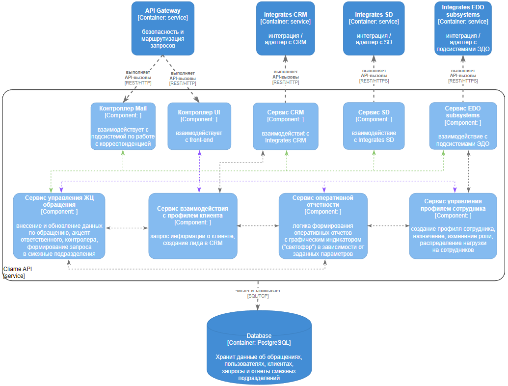
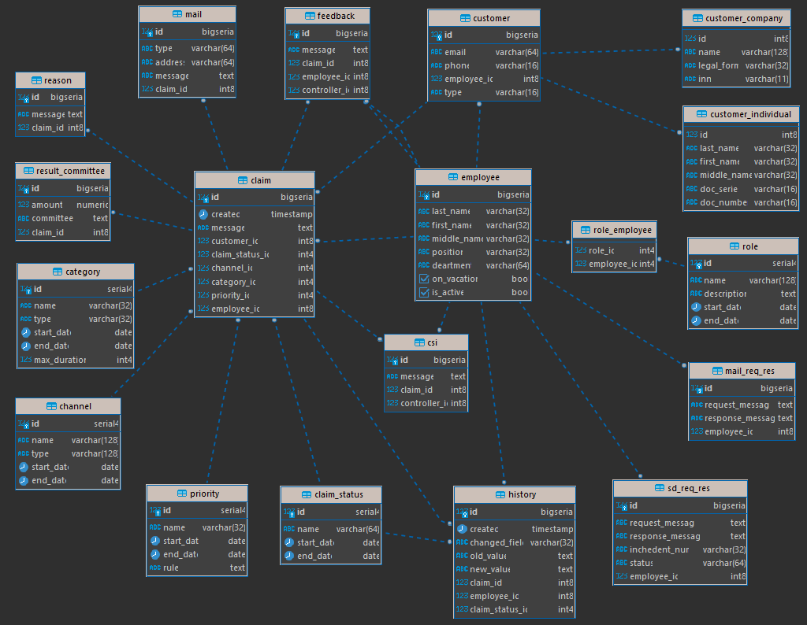
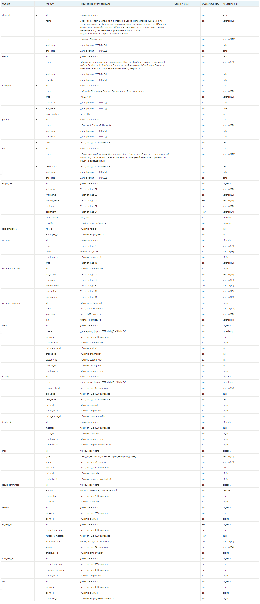

# Системный анализ, архитектура и моделирование

## **Содержание**
- [Проект архитектуры - C4 model](#проект-архитектуры---c4-model)  
- [Модель данных](#модель-данных)  
- [Описание структуры данных](#описание-структуры-данных-через-словарь-данных)   
#

## **Проект архитектуры - C4 model**
### **Диаграмма системного контекста** 

#

### **Диаграмма контейнеров** 

#

### **Диаграмма компонентов** 

#

## **Модель данных**

- [Скрипт создания БД](../doc/init_db.sql)
- [Скрипт наполнения данными БД](../doc/data_db.sql)
- [Примеры запросов к БД](../doc/query.sql)

#

## **Описание структуры данных через словарь данных**

